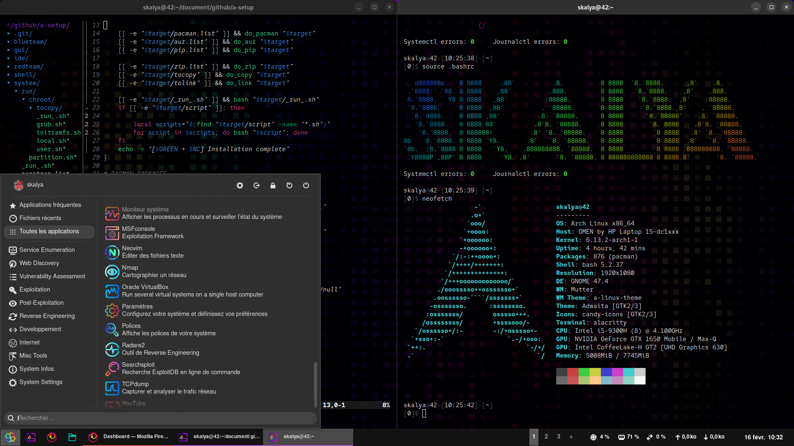

| Component | Name | Configs |
|-|-|-|
| OS | Arch Linux | [./system](./system) |
| Shell | Bash | [.bashrc](./shell/rsrc/.bashrc) |
| IDE | Neovim | [init.lua](./ide/rsrc/.config/nvim/init.lua) |
| Terminal | Alacritty | [alacritty.yml](./gui/rsrc/.config/alacritty/alacritty.yml) |
| Desktop Environment | GNOME | [gsettings](./gui/script/gsetting) |
